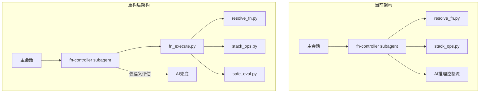

# fn-controller 重构实施计划

## 核心目标

将 fn-controller 的控制流逻辑从 AI 推理转移到确定性脚本，实现：

- 509 行提示词 → ~80 行
- 多次工具调用 → 单次启动 + 循环交互
- AI 负责所有控制流 → AI 仅负责语义评估

## 架构变化



---

## Phase 1: 基础设施准备

### 1.1 更新状态文件路径（设计文档 10.12 节）

当前格式：`scripts/states/<session_id>.json`

目标格式：`scripts/states/<session_id>/state.json`

**需要更新的文件**：

- [`scripts/stack_ops.py`](scripts/stack_ops.py) - `get_state_file()` 函数（第92-94行）
- [`scripts/run_chain.py`](scripts/run_chain.py) - `state_file` 变量（第59行）
- [`scripts/check_chain.py`](scripts/check_chain.py) - 状态文件路径
- [`scripts/test_stack_ops.py`](scripts/test_stack_ops.py) - 测试中的路径

### 1.2 创建 safe_eval 模块

创建 [`scripts/safe_eval.py`](scripts/safe_eval.py)：

```python
# 核心功能（设计文档 4.8 节）
def safe_eval(expr: str) -> Any:
    """安全的表达式求值，失败时抛异常交给 AI"""
    # 支持：算术、比较、逻辑、成员测试、字面量
    # null 映射为 Python None
```

### 1.3 更新 schema（设计文档 10.11 节）

更新 [`functions/_schema.json`](functions/_schema.json)：

- switch 新语法：`cases` + `case/then/default`（替代 `conditions` + `when`）
- 保留现有类型：return/call/tail_call/sequence/loop
- triggers 类型后续添加

---

## Phase 2: 迁移测试函数

将 [`functions/tests/`](functions/tests/) 下的函数从旧语法迁移到新语法。

**示例迁移**（`test_branch.json`）：

旧语法：

```json
{"type": "switch", "conditions": [{"when": "$mode == 'A'", "call": "..."}]}
```

新语法：

```json
{"type": "switch", "cases": [{"case": "$mode == 'A'", "then": {"call": "..."}}]}
```

**需迁移的文件**：

- `test_branch.json` - switch 分支测试
- 其他包含 switch 的函数

---

## Phase 3: 核心脚本开发

### 3.1 创建 fn_execute.py（设计文档 6.1, 6.4, 10.13 节）

创建 [`scripts/fn_execute.py`](scripts/fn_execute.py) - 交互式持久进程：

**模块结构**：

```
fn_execute.py
├── main()                      # 入口
├── parse_command()             # 解析 start/continue 指令
├── handle_start()              # start 处理
├── handle_continue()           # continue 处理
├── route_on_complete()         # 路由分发
│   ├── handle_return()
│   ├── handle_call()
│   ├── handle_tail_call()
│   ├── handle_switch()         # DFA 单分支
│   ├── handle_sequence()       # 管理 step_index 和 $prev
│   └── handle_loop()           # while 条件
├── substitute_vars()           # 变量替换（JSON 序列化保持类型）
├── try_eval()                  # 尝试评估，失败返回 None
├── request_ai_eval()           # 输出问题 + <<CC_FN_INPUT_NEEDED>>
└── output_task()               # 输出任务，保存状态，退出
```

**复用现有脚本**（通过 subprocess 调用）：

- `resolve_fn.py` - 函数解析
- `stack_ops.py` - 栈操作

**输出格式**（设计文档 6.2 节）：

- `[TASK]` - 需要主会话执行的任务
- `[EVAL]` - 需要 AI 语义评估
- `[COMPLETE]` - 执行完成

### 3.2 实现子代理复用策略（设计文档 10.14.3 节 - 方案 C）

在 `state.json` 中添加 `controller` 字段：

```json
{
  "stack": [...],
  "controller": {
    "resume_count": 3,
    "max_resume_before_refresh": 5
  }
}
```

脚本输出包含 `resume_next` 布尔值，主会话据此决定下次复用还是新建。

---

## Phase 4: 单元测试

### 4.1 创建测试目录

创建 `scripts/tests/` 目录，包含：

- `test_safe_eval.py` - safe_eval 各种表达式测试
- `test_fn_execute.py` - fn_execute 各控制流类型测试
- `test_var_substitute.py` - 变量替换测试

### 4.2 测试覆盖

| 测试类型 | 覆盖内容 |

|---------|---------|

| safe_eval | 算术、比较、逻辑、成员测试、null、失败场景 |

| 控制流 | return/call/tail_call/switch/sequence/loop |

| 变量替换 | 类型保持、特殊字符转义、$prev |

| 嵌套场景 | sequence 中的 call、loop 完整循环 |

---

## Phase 5: 集成测试

使用 [`functions/tests/`](functions/tests/) 下的测试函数验证完整流程：

- `test_loop` - 循环测试
- `test_sequence` - 序列测试
- `test_branch` - 分支测试（迁移后的新语法）
- `test_recursion` - 递归测试

---

## Phase 6: 提示词更新

### 6.1 更新 fn-controller 提示词

更新 [`.claude/agents/fn-controller.md`](.claude/agents/fn-controller.md)：

从 509 行压缩到约 80 行，核心内容：

- 启动命令
- 交互循环说明
- 评估类型和答案格式表
- resume_next 处理

**新提示词结构**（设计文档 6.3 节）：

```markdown
# fn-controller
## 启动
## 交互循环（情况 A/B/C）
## continue 命令
## 评估类型表
## 重要约定
## 输出格式
```

---

## 实施顺序

1. **Phase 1** → 基础设施准备（状态路径、safe_eval、schema）
2. **Phase 2** → 迁移测试函数
3. **Phase 3** → 核心脚本开发（fn_execute.py）
4. **Phase 4** → 单元测试
5. **Phase 5** → 集成测试
6. **Phase 6** → 提示词更新

每个 Phase 完成后进行验收，确保回归测试通过后再进入下一阶段。

---

## 关键约束（来自设计文档末尾）

1. 方案中没有覆盖的点，继承现有功能和实现
2. 模块化实现，复用现有脚本（调用而非复制）
3. 每一步可验收，先自验再交付
4. 单测在 `scripts/tests/` 目录
5. 注意 WT_SESSION 环境变量问题（Cursor Agent 中可能未配置）