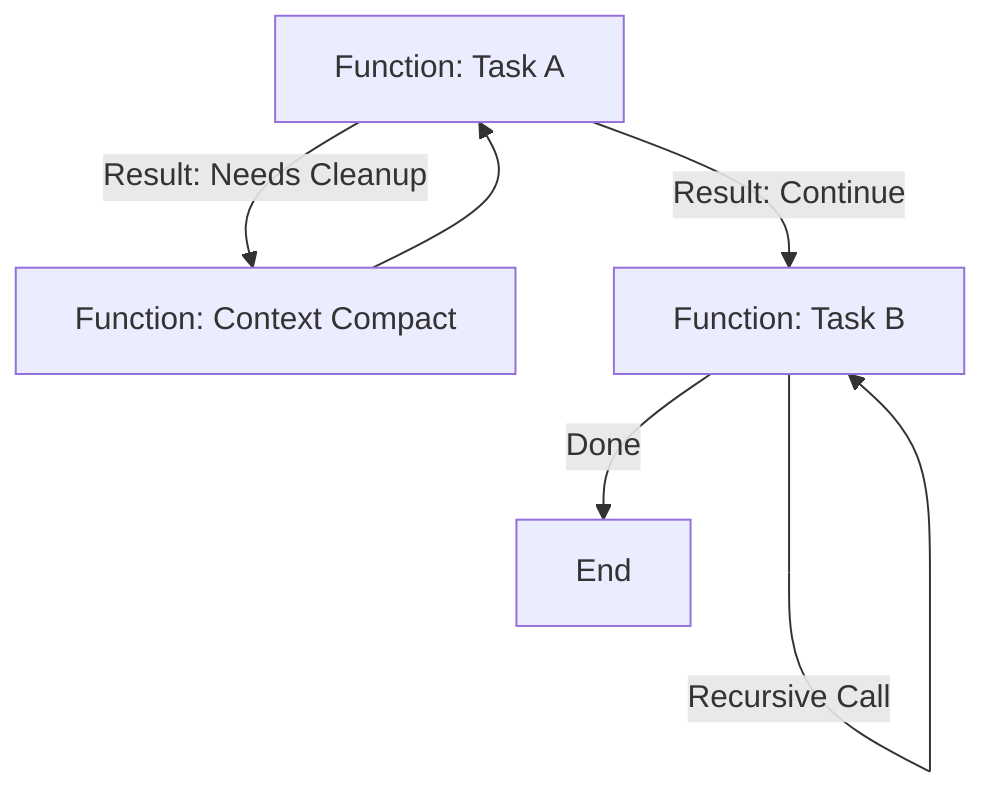

# Design by Gemini: 基于 Claude Code Agent SDK 的递归性任务与决策图设计

本设计文档旨在完善 `thoughts/design.md` 中的构想，特别是针对 **"Function-Skill"** (函数式技能) 的设计。

结合 **Claude Code Agent SDK** 的能力，我们不再局限于静态的 `SKILL.md` 索引或简单的 Shell 脚本堆叠，而是采用 **"Host-Driven Agency" (宿主驱动代理)** 模式。我们将 "Skill" 提升为真正的编程语言函数 (Python/TypeScript)，利用宿主语言的控制流（循环、递归、条件判断）来实现稳定、复杂的决策图。

## 1. 核心理念：Function-Skill 作为元框架

我们定义 **`function-skill`** 为一个 **Meta-Skill (元技能)** 或 **Agent Framework**。
它是在 **Claude Code Agent SDK** 之上构建的一层抽象框架。

*   **框架层 (`function-skill`)**: 提供任务调度、上下文管理、工具暴露、递归调用机制等通用能力。它本身不包含具体业务逻辑。
*   **实例层 (Instances)**: 用户基于此框架定义的具体 Function（如 `task_a`, `task_b`）。框架需要“实例化”具体的 Function 才能工作。

之前的思路试图在 Prompt 或 Markdown 中模拟编程逻辑，这导致了上下文丢失和执行脆弱性。

**新的设计理念 (Host-Driven Agency)：**
*   **控制流归宿主**: 递归、分支、循环由宿主语言（或未来的 DSL）控制。
*   **思考归模型**: 具体任务的执行由 `claude code` 完成。
*   **状态即变量**: 状态作为参数传递。

这种方式完美契合你提出的 **Idea 3 (Function Abstraction)**，并且利用 SDK 提供了原生的实现路径。

## 2. 架构设计

### 2.1 角色定义

1.  **Orchestrator (编排器)**: 一个使用 Agent SDK 的 Python/TS 程序。它定义了 `functions` (即你的 `task_a`, `task_b`)。
2.  **Worker (执行者)**: 在每个 Function 内部被调用的 `claude` 实例 (Client Session)。它专注于当前原子任务。
3.  **Context (上下文)**: 通过函数参数传递的明确状态对象，而非隐式的对话历史。

### 2.2 决策图实现 (Decision Graph)

不再依赖 LLM "决定" 去读哪个 Markdown 文件，而是由 LLM 返回结构化结果 (Decision)，宿主程序根据结果调用下一个 Function。



## 3. 具体实现方案 (基于 Agent SDK)

假设我们使用 Python SDK (伪代码/逻辑示意) 来实现你的 `function-skill`。

### 3.1 基础 Function 定义

每个 "Function Skill" 都是一个 Python 函数，它封装了一次独立的 Agent 会话（或复用会话）。

```python
from claude_code_client import ClaudeCodeClient, AgentOptions

async def function_skill_wrapper(task_name: str, context_data: dict, objective: str):
    """
    通用 Function 包装器
    Args:
        task_name: 任务名称
        context_data: 上一步传来的状态 (Input)
        objective: 当前步骤的具体提示词
    Returns:
        Result: 包含执行结果和下一步建议的结构化数据
    """
    print(f"--- Running Function: {task_name} ---")
    
    # 1. 构建当前步骤的 Prompt
    # 将结构化数据转换为自然语言提示词
    prompt = f"""
    Current Task: {task_name}
    Context: {context_data}
    
    Objective: {objective}
    
    After completing the work, output a JSON summary indicating the next step.
    """

    # 2. 调用 Claude Code SDK
    client = ClaudeCodeClient()
    # 这里的关键是：我们可以限制这次调用的权限、工具，甚至 Model
    # 遵循渐进式暴露原则：每次只暴露当前步骤所需的工具/Function，保持函数栈顶清晰
    result = await client.query(prompt, options=AgentOptions(
        verbose=True,
        tools=["bash", "edit", "repl"] # 按需开放工具，而非全部
    ))

    # 3. 解析结果 (Output)
    # 假设我们约定 Agent 最后会输出某种特定格式，或者我们用辅助 LLM 解析 log
    structured_output = parse_result(result)
    
    return structured_output
```

### 3.2 递归与编排 (The Recursion)

实现你的 `task_a` 逻辑：

```python
async def task_a(input_data):
    # 定义该任务的目标
    objective = "Analyze the input and decide on the next step."
    
    # 调用 Agent 执行
    result = await function_skill_wrapper("Task_A", input_data, objective)
    
    # 宿主语言处理控制流 (Switch/Case 逻辑)
    decision = result.get("decision")
    
    if decision == "compact_context":
        # 调用内置指令函数
        await claude_code_context_compact()
        # 递归调用自己，或者继续
        return await task_a(input_data)
        
    elif decision == "call_task_c":
        # 示例：先清理上下文，再处理数据
        await claude_code_context_clear()
        # 处理逻辑...
        return await task_c(input_data)

    elif decision == "call_task_b":
        # 转换数据
        new_input = input_data + " + processed_data"
        # 调用下一个函数
        return await task_b(new_input)
        
    elif decision == "finish":
        return result.get("final_output")
        
    else:
        # 默认处理：继续细化当前任务
        # 这里体现了“可靠性”：如果不知道怎么办，可以报错或重试，而不是直接断掉
        print("Unknown decision, retrying...")
        return await task_a(input_data)
```

## 4. 关键特性实现

### 4.1 可靠性设计 (Stop-Hook 替代方案)

你提到的 `stop-hook` 在 SDK 模式下变得非常简单。因为 `client.query()` 是一个异步调用，我们可以在外层完全掌控。

*   **超时控制**: `asyncio.wait_for(..., timeout=...)`
*   **循环验证 (Ralph Loop)**:
    ```python
    max_retries = 3
    while max_retries > 0:
        result = await run_agent(...)
        if validate(result):
            break
        print("Task failed validation, retrying with feedback...")
        max_retries -= 1
    ```
*   **状态持久化**: 在 Function 之间，可以将 `input_data` 和 `result` 序列化保存到本地 JSON 文件，这样即使程序崩溃，也能从断点恢复 (Resume)。

### 4.2 "Function" 的具体形态

*   **命名 Function**: Python 函数名即 Skill 名。
*   **匿名 Function (Lambda)**: 动态生成的 Prompt + `client.query()` 调用。
*   **内置指令**: 如 `context_clear`，可以直接映射为 SDK 的 `client.reset_session()` 或类似 API。

### 4.3 无头模式 (Headless)

SDK 本质上就是无头模式的高级封装。你提到的：
`cat "提示词" | claude` 
在 SDK 中就是：
`client.query("提示词")`

这避免了 Shell 管道处理文本的脆弱性。

## 5. 迁移与最佳实践建议

1.  **遵循渐进式暴露原则 (Progressive Exposure)**:
    *   **原则**: 每次只暴露一个 Function 或当前上下文绝对必要的工具。
    *   **实现**: 在 SDK 中，利用 `options.tools` 动态过滤可见工具。
    *   **收益**: 减少 Token 消耗，防止 Agent 在复杂的工具列表中迷失，模拟“函数栈”的单一栈顶行为。

2.  **不要放弃 `SKILL.md`，但要降级它**:
    *   保留 `SKILL.md` 用于定义**原子能力**（例如：“如何运行测试”、“如何部署到 staging”）。
    *   使用 **SDK (Python/TS)** 来定义**业务流程**（例如：“重构代码流程”、“新功能开发流程”）。

3.  **数据类型标准化**:
    *   虽然你提到“数据类型都抽象为提示词文本”，但在 Function 之间传递 JSON 对象会更精确。
    *   Agent (LLM) 负责 **Text -> JSON** 的理解。
    *   Host (Python) 负责 **JSON -> Logic** 的路由。

4.  **从脚本开始**:
    *   先写一个 `runner.py`，尝试用 SDK 完成一个两步走的任务（Step 1: 搜索信息 -> Step 2: 总结写入文件）。
    *   验证通过后，再引入递归逻辑。

## 6. 实施路线图 (Implementation Roadmap)

### 阶段一：可行性与可靠性验证 (Current Focus)
**目标**: 验证 "Host-Driven Agency" 模式在处理递归、上下文传递和复杂决策图时的稳定性。

*   **实现方式**: 直接使用 **Claude Code Agent SDK (Python/TypeScript)** 编写硬编码的调度逻辑。
*   **验证点**:
    1.  **递归深度**: 测试多层递归调用是否会导致上下文丢失或 Token 爆炸。
    2.  **错误恢复**: 验证 `try-catch` 和 Retry 机制能否有效处理 Agent 的偶发错误。
    3.  **状态传递**: 验证 JSON 状态对象在 Function 间的流转是否准确。
*   **产出**: 一个可运行的 Demo，包含 `task_a` 调用 `task_b` 并递归调用的完整链路。

### 阶段二：抽象与 DSL 优化 (Optimization & Abstraction)
**目标**: 降低使用门槛，将宿主语言的复杂性屏蔽，构建极简的 **"Function-Skill DSL"**。

*   **痛点解决**: 宿主语言 (Python/TS) 对非专业开发者仍显复杂。我们需要一个更简单的层来描述控制流。
*   **DSL 设计目标**:
    *   **极简语法**: 使用配置描述文件 (YAML/JSON) 或极简自定义语法。
    *   **核心原语**: 支持 `Loop` (循环), `Recursion` (递归), `Condition` (条件判断), `Branch` (分支), `Sequence` (序列), `Call` (函数调用)。
*   **实现逻辑**:
    *   开发一个解释器 (Interpreter)，读取 DSL 配置。
    *   解释器在底层自动调用 Agent SDK，动态构建 Prompt 和管理 Session。
    *   用户只需编写配置文件，不再需要写 Python 代码。

## 7. 总结

| 特性 | 旧方案 (Markdown Index) | 脚本方案 (Shell Scripts) | **新方案 (SDK Function-Skill)** |
| :--- | :--- | :--- | :--- |
| **控制流** | 脆弱 (LLM 幻觉导致中断) | 中等 (Shell 逻辑难维护) | **极强 (Python 原生控制流)** |
| **状态传递** | 隐式 (上下文窗口) | 显式 (文件/参数) | **显式 (对象/结构体)** |
| **递归性** | 极难实现 | 可实现但复杂 | **原生支持** |
| **可靠性** | 低 | 中 | **高 (可加 Try-Catch/Retry)** |

**结论**: 你的 **Idea 3** 是正确的方向。使用 **Claude Code Agent SDK** 将 Skill 封装为编程语言中的 Function，是实现复杂、递归决策图的最佳途径。
